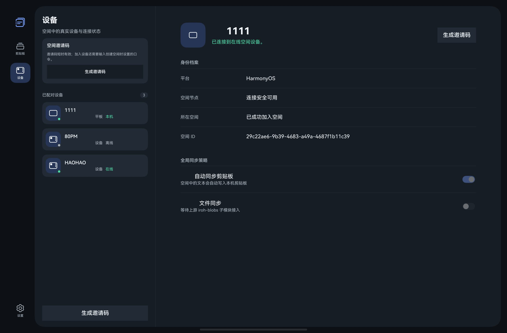

# UniClipboard for HarmonyOS

UniClipboard 的 HarmonyOS 原生社区客户端，使用 ArkTS/ArkUI 构建，并通过 Rust Node-API 桥接复用上游空间核心和移动同步协议。

> 本项目是社区维护的 HarmonyOS 客户端，并非 UniClipboard 上游官方发行版。请勿将剪贴板历史作为关键数据的唯一副本；已知限制见下文。

## 下载

UniClipboard 已正式上架华为应用市场，可直接在 HarmonyOS 手机、平板和电脑上安装：

**[前往华为应用市场下载 UniClipboard](https://appgallery.huawei.com/app/detail?id=com.uniclipboard.hmos&channelId=SHARE&source=appshare)**

当前应用版本为 `1.0.3`。应用市场版本适合日常安装使用；开发者也可以按照下文说明自行构建最新源码。



## 与上游项目的关系

本仓库基于 [UniClipboard/UniClipboard](https://github.com/UniClipboard/UniClipboard) 的 AGPL-3.0 代码进行 HarmonyOS 适配，保留并修改了部分 Rust 空间核心与移动同步协议实现。上游快照来自 `0.19.0-alpha.3` 开发阶段的源码归档；原始归档没有保留精确 Git 提交号。

主要修改包括：

- 新增 HarmonyOS ArkTS/ArkUI 应用、系统剪贴板接入和多设备响应式界面；
- 新增基于 `ohos-rs` 的 Rust Node-API 桥接与 arm64-v8a 构建脚本；
- 适配 HarmonyOS Asset Store、Preferences、Image Kit 与应用沙箱；
- 对上游空间邀请、P2P 剪贴板同步和移动端接入服务进行 HarmonyOS 封装。

详细归属与修改说明见 [NOTICE.md](./NOTICE.md)。本仓库整体按 AGPL-3.0-only 发布，完整条款见 [LICENSE](./LICENSE)。

## 已实现

- 使用 `XXXX-XXXX` 短时邀请码和空间口令加入 UniClipboard 空间；
- 通过端到端加密 P2P 空间链路收发文本、图片和文件；
- 空间身份、成员关系和密钥保存在 HarmonyOS 应用沙箱中；
- 可选启用移动端接入服务，让其他移动设备连接当前 HarmonyOS 设备；
- 历史记录由 Engine 加密存储，支持查询、搜索、收藏和删除；
- Engine 事件通知、中文/英文资源、深色/浅色主题；
- 手机、平板和二合一设备布局；
- 首次启动引导，以及按屏幕宽度切换的 Compact/Expanded 产品视图；
- 支持从系统分享面板接收文本、链接、图片和文件，并发送到全部在线设备或指定设备；
- 支持按设备分别设置发送、接收方向及文本、图片、文件、链接和富文本等内容类型；
- 提供连接诊断，检查网络、权限、空间节点和直连/中继状态，并可导出脱敏诊断日志；
- 历史库支持按设备、标签和常用片段筛选，自定义标签、批量收藏/删除、保留期限及重复记录合并；
- 支持图片文字识别，并从识别结果中提取链接、电话号码和二维码等智能操作；
- 旧桌面 HTTP/SSE 客户端已移除；升级时会清理旧服务地址和凭据。

## 分层架构

工程采用单向依赖的四层结构，产品 UI 与业务状态、公共服务和原生协议实现相互分离：

```text
products/default (Entry HAP)
  ├─> features/clipboard (HAR)
  └─> common (HAR) ──> rust/uniclipboard-native/package (Native HAR)
```

- 产品定制层负责 Ability、响应式设备视图、应用身份资源和产品配置；
- 基础特性层负责剪贴板共享状态与业务流程编排；
- 公共能力层提供数据模型、存储、系统剪贴板、通知和同步服务；
- 原生实现层复用 Rust 协议核心，并通过 Node-API 向 ArkTS 暴露能力。

模块边界、依赖方向和扩展约定详见 [ARCHITECTURE.md](./ARCHITECTURE.md)。

## 正确使用方式

### 推荐：加入加密空间

1. 在桌面端安装并打开官方 UniClipboard，在第一台设备创建空间并设置空间口令。
2. 在空间内的已有设备打开“设备”，生成短时邀请码。
3. 在 HarmonyOS 客户端进入“设置 → 加入空间”，扫码或输入邀请码，并填写同一个空间口令。
4. 加入成功后，在“同步”页发送或接收内容。首次读取系统剪贴板时，按系统提示授权。

邀请码是短时凭据，不应截图后长期保存或公开；空间口令不要通过与邀请码相同的渠道发送。

## 从源码构建

### 环境要求

- DevEco Studio 与 HarmonyOS SDK；本工程当前目标和最低兼容 API 均为 24（官方 Engine `v1.1.0-rc.5` 要求 API 24）；
- PowerShell 与 `devecocli`；
- 仅在修改 Rust 原生层时需要 Rust 工具链、`cargo` 和 `ohrs`。

克隆后，仓库中已包含 arm64-v8a 原生库，可直接构建 ArkTS 工程：

```powershell
git clone https://github.com/haohaoai0/UniClipboardHarmonyOS.git
cd UniClipboardHarmonyOS
devecocli build
```

只构建当前产品入口及其依赖时，可以显式指定模块和目标：

```powershell
devecocli build --modules entry@default
```

真机安装需要在 DevEco Studio 中为你自己的应用配置调试或发布签名。仓库不会保存证书、私钥或签名口令。

如果修改了 `rust/` 下的原生代码，先设置 SDK 路径并重建本地包：

```powershell
$env:DEVECO_SDK_HOME = 'C:\path\to\openharmony'
.\rust\build-native.ps1
devecocli build
```

也可以显式传入 SDK 路径：

```powershell
.\rust\build-native.ps1 -NativeSdk 'C:\path\to\openharmony'
```

连接调试设备后运行：

```powershell
devecocli run --module entry --product default
```

## 源码结构

- `products/default/`：默认产品的 Entry HAP、Ability 和 Compact/Expanded 响应式界面；
- `features/clipboard/`：剪贴板特性 HAR，封装共享状态和业务流程；
- `common/`：公共能力 HAR，包含模型、存储、通知与同步服务；
- `AppScope/`：应用级资源与元数据；
- `rust/uniclipboard-native/`：HarmonyOS Node-API 桥；
- `rust/space-core/`：为本移植版保留的上游 Rust 核心快照；
- `rust/build-native.ps1`：arm64-v8a 原生库构建与本地包装配脚本。

当前构建入口由根 `build-profile.json5` 指向 `products/default/`。

## 当前边界

- 桌面配对、加密历史、成员偏好和剪贴板传输统一由 Engine HAR 提供；
- 系统剪贴板监听会自动发送文本、图片和文件，后台轮询由长时任务保持；
- HTTP 兼容服务仅用于其他移动设备接入当前设备，不再用于连接桌面端；
- 当前仓库只提供 arm64-v8a 原生库；
- 应用市场发布不代表 UniClipboard 上游官方背书；协议兼容性仍可能随上游预览版本变化。

## 参与贡献与安全问题

提交代码前请阅读 [CONTRIBUTING.md](./CONTRIBUTING.md)。安全漏洞不要公开提交 Issue，请按 [SECURITY.md](./SECURITY.md) 中的方式报告。

## 许可证

本仓库整体按 [GNU Affero General Public License v3.0 only](./LICENSE) 发布。分发修改版或通过网络向用户提供修改版服务时，需要同时提供相应源码并保留许可证、版权和修改声明。`UniClipboard` 名称及上游原始素材仅用于说明兼容关系；本社区仓库不代表上游官方背书。
